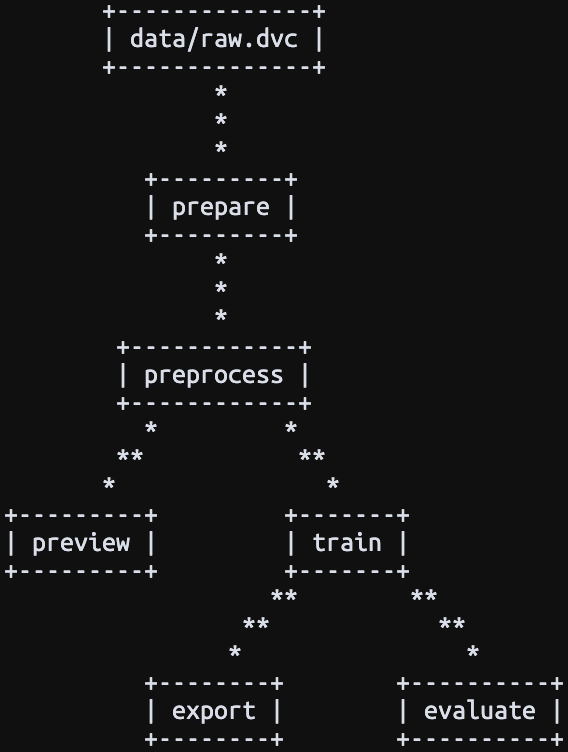

# SwissImage Vision

- [TODO](#todo)
- [Installation](#installation)
  - [Setup DVC](#setup-dvc)
- [Reproduce the Experiment](#reproduce-the-experiment)
- [Serving the Model](#serving-the-model)
  - [Gradio Demo](#gradio-demo)
  - [BentoML API](#bentoml-api)
- [LabelStudio](#labelstudio)
  - [Configuration](#configuration)
  - [Automated Labeling](#automated-labeling)
- [Reference](#reference)
  - [DVC](#dvc)
- [Resources](#resources)
  - [Data](#data)
  - [Projects](#projects)


## TODO

- Better model evaluation metrics and plots
- PR and main branch CI/CD
- CML reporting
- CML training on Kubernetes cluster
- Add label studio configuration
- (Label studio web hook to DVC)
- (Label studio model training with DVC)
- Add more training data
- Deploy BentoML API to Kubernetes cluster
- (Deploy label studio instance)

## Installation

If you don't have Conda installed, you can run the following script to install it:

```bash
./scripts/install_conda.sh
```

Next, restart your terminal and create a new conda environment and install the dependencies:

```bash
conda create --name swissimage-vision python=3.12 pip
conda activate swissimage-vision
```

```bash
pip install -r requirements.txt
```

### Setup DVC

Add the MinIO credentials to the DVC configuration:

```bash
dvc remove modify --local minio access_key_id <ACCESS_KEY_ID>
dvc remove modify --local minio secret_access_key <SECRET_ACCESS_KEY>
```

Pull the data from the remote storage:

```bash
dvc pull
```

## Reproduce the Experiment

To reproduce the experiment, execute the following command:

```bash
dvc repro
```

To view the training logs, run the following command:

```bash
tensorboard --logdir lightning_logs
```

## Serving the Model

### Gradio Demo

Run the following command to start the Gradio demo interface:

```bash
python3 src/demo.py
```

### BentoML API

```bash
python3 src/serve.py
```

## LabelStudio

**NOTE:** Documentation WIP

```bash
conda install conda-forge::psycopg2-binary
```

```bash
pip install label-studio>=0.11.0,<=0.12
```

Run the following command to start a local backend for Label Studio:

```bash
python3 scripts/serve_label_studio.py
```

```bash
# label-studio start ./label-studio/config.xml
```

### Configuration

### Automated Labeling

## Reference

### DVC



The experiment is managed using DVC. The following is the DAG of the experiment:

```bash
dvc dag
```

It is divided into the following stages:

- `prepare`
- `preview`
- `train`
- `export`
- `evaluate`
- `detect`

## Resources

### Data

- http://2019.geopython.net/data/solar.zip
- https://ep2020.europython.eu/media/conference/slides/detecting-and-analyzing-solar-panels-switzerland-using-aerial-imagery.pdf
- https://zenodo.org/records/5171712

### Projects

- https://github.com/shashankag14/fine-tune-object-detector/blob/main/fine_tune.ipynb
- https://github.com/swiss-ai-center/giscup2023-resnet-unet
- https://pytorch.org/tutorials/intermediate/torchvision_tutorial.html
- https://github.com/saizk/Deep-Learning-for-Solar-Panel-Recognition?tab=readme-ov-file
