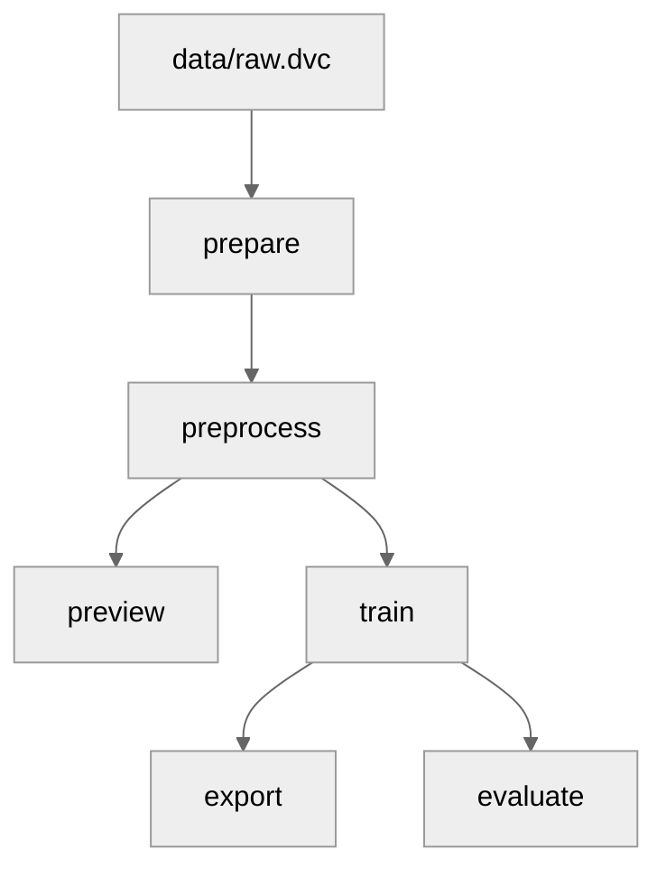

# Concepts

- [Overview](#overview)
- [GitHub Actions Integration](#github-actions-integration)
  - [Development Cycle](#development-cycle)
  - [Action Workflows](#action-workflows)
- [DVC Integration](#dvc-integration)
  - [Stages](#stages)
    - [Prepare](#prepare)
    - [Preprocess](#preprocess)
    - [Preview](#preview)
    - [Train](#train)
    - [Export](#export)
    - [Evaluate](#evaluate)
  - [Directed Acyclic Graph (DAG)](#directed-acyclic-graph-dag)
  - [Data Flow](#data-flow)
- [Label Studio Integration](#label-studio-integration)

## Overview

The goal of this page is to provide an more detailed explanation of the integrations and concepts used in this project.

## GitHub Actions Integration

### Development Cycle

<p align="center">
  
</p>

1. The developer pushes code into an active pull request.
2. The GitHub Action workflow is triggered.
3. The self-hosted GitHub runner creates another self-hosted runner with GPU and runs the `train-and-report` step.
4. `train-and-report`:
   1. Runs the DVC pipeline and reports the results back to the pull request
   2. Pushes the results to the DVC remote storage
   3. Pushes the updated DVC lock file to the repository
5. The developer reviews the results and merges the pull request.

### Action Workflows

The GitHub Action workflows are defined in the `.github/workflows` directory.

The workflow `train-and-report.yaml` is triggered when a pull request is opened or updated. The workflow runs the following steps:

- `setup-runner` - Create a self-hosted gpu runner
- `train-and-report` - Runs the DVC pipeline and reports the results back to the pull request
- `cleanup-runner` - Deletes the self-hosted gpu runner

## DVC Integration

The full pipeline is implemented using DVC and can be found in `dvc.yaml`.

The pipeline is composed of 6 stages: `prepare`, `preprocess`, `preview`, `train`, `export`, and `evaluate`. Each stage is implemented in a separate script in the `src` directory.

The parameters for each stage are defined in the `params.yaml` file.

### Stages

#### Prepare

In this stage we:

1. Pull raw data from DVC remote (SwissBoundaries3D)
2. Create tiles and upload to S3

We upload the tiles and annotations to S3 to avoid storing them in DVC cache. This is because it would not be efficient to store large amounts of data in DVC cache. Instead, we store the data in S3 and pull it when needed. See more in the <a href="#train">Train</a> stage.

> [!NOTE]
> As this stage does not create any outputs (we are saving the dataset to a S3 bucket), we create a dummy output (`data/prepared/depends.txt`) to make other stages depend on this one. See more about this [here](https://github.com/iterative/dvc/issues/8881).

#### Preprocess

In this stage we:

1. Pull LabelStudio annotations from S3
2. Merge into a single JSON file
3. Preprocess the annotations (distribute equally among image with and without bounding boxes)
4. Save it into DVC cache

#### Preview

In this stage we:

1. Pull some images from S3
2. Save them into DVC cache

#### Train

In this stage we train the model using PyTorch lightning. We use PyTorch to prefetch and convert the images and annotations to tensors from the S3 bucket. This way we can train on the fly without storing data in the pod or in DVC cache.

#### Export

In this stage we export the model to TorchScript and wrap it in a BentoML model.

#### Evaluate

In this stage we evaluate the model on the test set. (not implemented yet)

### Directed Acyclic Graph (DAG)

```bash
dvc dag
```

<div align="center">



</div>

### Data Flow

<p align="center">
  
</p>

## Label Studio Integration

Label Studio is used to label the data. The data (images in this case) is stored in S3 and the annotations are stored in the Label Studio database.

It is configured to sync with the S3 bucket and pull the images from there as well as push the annotations back to S3. These are the concepts of `import storage` and `export storage` that can be found in the Label Studio UI under `Project Settings -> Cloud Storage`.

The annotations are pulled from S3 in the `preprocess` stage and merged into a single JSON file.

> [!NOTE]
> The `preprocess` stage uses the condition `always_changed: true` in `dvc.yaml` to force the stage to run every time. This is because the annotations are constantly being updated in Label Studio and we want to pull the latest annotations every time we run the pipeline.
