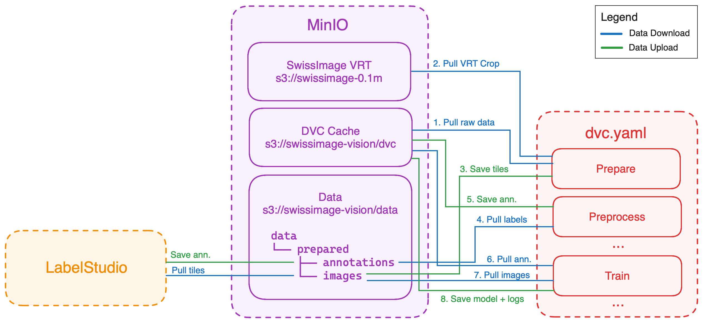

# DVC Integration

- [About](#about)
- [Stages](#stages)
  - [Prepare](#prepare)
  - [Preprocess](#preprocess)
  - [Preview](#preview)
  - [Train](#train)
  - [Export](#export)
  - [Evaluate](#evaluate)
- [Directed Acyclic Graph (DAG)](#directed-acyclic-graph-dag)
- [Data Flow](#data-flow)

## About

The full pipeline is implemented using DVC and can be found in `dvc.yaml`.

The pipeline is composed of 6 stages: `prepare`, `preprocess`, `preview`, `train`, `export`, and `evaluate`. Each stage is implemented in a separate script in the `src` directory.

The parameters for each stage are defined in the `params.yaml` file.

## Stages

### Prepare

In this stage we create tiles and upload to S3.

We upload the tiles and annotations to S3 to avoid storing them in DVC cache. This is because it would not be efficient to store large amounts of data in DVC cache. Instead, we store the data in S3 and pull it when needed. See more in the <a href="#train">Train</a> stage.

> **Note**
> As this stage does not create any outputs (we are saving the dataset to a S3 bucket), we create a dummy output (`data/prepared/depends.txt`) to make other stages depend on this one. See more about this [here](https://github.com/iterative/dvc/issues/8881).

### Preprocess

In this stage we:

1. Pull LabelStudio annotations from S3
2. Merge into a single JSON file
3. Save it into DVC cache

### Preview

In this stage we:

1. Pull some images from S3
2. Save them into DVC cache

### Train

In this stage we train the model using PyTorch lightning. We use PyTorch to prefetch and convert the images and annotations to tensors from the S3 bucket. This way we can train on the fly without storing data in the pod or in DVC cache.

### Export

In this stage we export the model to TorchScript and wrap it in a BentoML model.

### Evaluate

In this stage we evaluate the model on the test set. (not implemented yet)

## Directed Acyclic Graph (DAG)

TODO: Needs update

## Data Flow

